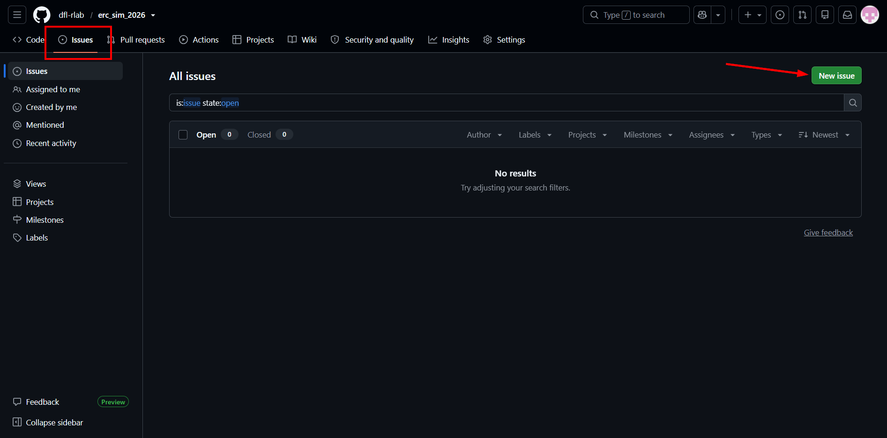

# Team AVAA — ERC 2026 Phase 1 solution

This is the organisers' `erc_sim_2026` workspace with Team AVAA's solution added. Our code is
the **`avaa_solution`** package in [`src/avaa_solution`](src/avaa_solution). The organisers'
original README follows after the line further down.

**Team AVAA**, University of Wollongong in Dubai. The robot finds the book of a given colour
under a given shelf column marker, takes it off the shelf and places it in the collection bin,
with no manual intervention.

## Build and run

```bash
# Host terminal, in the repository root
./docker/up.sh --build
./docker/attach.sh

# Inside the container
colcon build --symlink-install
source install/setup.bash
ros2 launch erc_bringup simulation.launch.py

# A second terminal: ./docker/attach.sh, then source install/setup.bash
ros2 launch avaa_solution solution.launch.py shelf_column_number:=3 book_colour:=red
```

| Launch argument | Values | Meaning |
|---|---|---|
| `shelf_column_number` | `1`–`5` | Digit on the overhead marker of the target column (markers are shuffled every load) |
| `book_colour` | `red`, `blue`, `green`, `yellow` | Colour of the target book (its row is found by the camera) |
| `save_images` | `true` (default), `false` | Save the annotated identification images |
| `rviz` | `false` (default), `true` | Open RViz with the planned and executed navigation paths |

The mission node logs the trial time at every phase, the moment a book touches the bin
(`/bin_contacts`), and `phase deliver -> done` when the arm is folded and the robot is still.

## The `avaa_solution` package

Perception, planning and execution run as separate nodes. The mission node alone decides
when each controller may act (`/avaa/mission/phase`) and alone publishes the scoring topics.

| Node (executable) | Role | Main interfaces |
|---|---|---|
| `avaa_mission` (`mission`) | Trial state machine: approach → grasp → deliver; trial clock; publishes the identifications as soon as they are confirmed | pub `/erc/shelf_column_identification`, `/erc/shelf_row_identification`, `/avaa/mission/phase`; sub `/bin_contacts` |
| `avaa_perception` (`perception`) | Reads the marker digits (template matching against the simulator's own digit textures), finds books by HSV colour and shape, locates the target book and the bin from depth, saves annotated images | sub head camera RGB + depth; pub `/avaa/perception/*` |
| `avaa_approach` (`approach`) | Tucks the arms, searches for the marker, centres on the column, drives in on the camera, squares up to the shelf | pub `/cmd_vel`, head, torso, arms, `/avaa/approach/state` |
| `avaa_grasp` (`grasp`) | Analytic IK picks the arm posture, MoveIt plans collision-free motion, a 5 Hz servo closes the last centimetres, then clamp, lift, withdraw and stow | MoveIt `move_group`, left arm, torso, gripper, `/avaa/grasp/state` |
| `avaa_deliver` (`deliver`) | Turns to find the bin, drives to it on the camera, squares up on the table legs (LiDAR), lowers the book into the bin, releases, folds the arm | pub `/cmd_vel`, left arm, gripper, `/avaa/deliver/state` |
| `avaa_path_recorder` (`path_recorder`) | Only with `rviz:=true`: planned and executed paths for RViz (`rviz/nav_paths.rviz`) | pub `/avaa/nav/*` |

Every controller checks its own progress and recovers where it can: the approach backs off
and re-acquires (twice) when it loses the book, delivery backs off and retries when blocked,
the grasp re-plans, and the mission refuses to deliver when the grasp reports failure.

| Module | Purpose |
|---|---|
| `vision/marker_reader.py`, `vision/book_detector.py`, `vision/depth_locator.py`, `vision/shelf_plane.py` | Pure OpenCV/numpy, no ROS, unit tested on synthetic frames |
| `kinematics/arm_chain.py` | Forward and inverse kinematics of the left arm and torso, from the URDF |
| `moveit_client.py` | Small synchronous client for `move_group` (Humble has no MoveIt Python API) |
| `table_frame.py`, `arena.py` | Bin position from the table legs; frame and height constants |
| `moveit/`, `launch/moveit.launch.py` | SRDF and MoveIt configuration for TIAGo Pro (the image ships none) |
| `config/gui.config` | Gazebo window layout used for our video (optional: `gz sim -g --gui-config ...`) |
| `test/` | Unit tests, no simulator needed: `cd /opt/erc_ws/src/avaa_solution && python3 -m pytest -q test` |

## Annotated images (`erc_images/`)

During the trial `avaa_perception` saves images from the live camera, each with the UTC
timestamp in the filename and burned into the picture:

- `column_<marker>_<time>.png`: box around the target column's marker
- `row_<row>_<colour>_<time>.png`: box around the target book

They are written to `src/avaa_solution/erc_images/`, because the stock `docker-compose.yml`
mounts only `src/` into the container. `erc_images` at the repository root links to that
folder. The images saved during the run in our video are committed there.

## Changes to the organisers' packages

| Files | Change | Why |
|---|---|---|
| `src/erc_bringup/scripts/sim_grasp_fix.py` (new), `src/erc_bringup/launch/simulation.launch.py` | **Simulation grasp aid, on by default** (`ERC_GRASP_FIX=0` turns it off) | The simulated gripper is position-controlled through passive mimic joints, so it cannot squeeze a book and a correctly placed grasp slips. When the jaws close within 90 mm of a book (or of where a book knocked over by the fingers stood), the aid moves that book with the gripper until the jaws open. It never moves the robot and never places a book, so a grasp that misses still fails. Not used on the real robot. |
| `src/erc_bringup/config/gazebo_controller_manager_cfg.yaml`, `src/gz_ros2_control/.../gz_ros2_control_plugin.cpp` | Arm position controller gain 0.1 → 5.0, and the plugin now reads its parameter file | At 0.1 the arm crawled and never reached its goals. Joint limits and effort ratings are unchanged. |
| `src/erc_bringup/config/cyclonedds.xml` (new), `docker/docker-compose.yml`, `docker/up.sh` | 32 MB DDS receive buffers | One camera frame is 691 KB; with default buffers camera frames were dropped |

---

# Emirates Robotics Competition 2026

Library Assistant Robot challenge: Autonomous book retrieval using a TIAGo Pro mobile manipulator.

 

## Prerequisites

- x86_64 (amd64) architecture. ARM-based hosts (e.g. Apple Silicon) are not supported
- Linux host (Ubuntu 22.04/24.04 recommended) with X11
- Docker Engine + Docker Compose v2
- Git
- NVIDIA GPU + nvidia-container-toolkit for GPU-accelerated rendering        # Rendering is slow but possible without NVIDIA GPU
- ~15GB free disk space

**Note:** The default `ROS_DOMAIN_ID` is `23`. If you are running multiple ROS 2 environments on the same network, ensure there are no domain ID conflicts.

## Quick start

All dependencies are vendored in this repository — there is no separate dependency-fetching step, and no network access is needed after cloning.

```bash
# — Host terminal —
./docker/up.sh --build                        # Build image & start container
./docker/attach.sh                            # Open shell inside container

# — Inside container (after attach) —
colcon build --symlink-install                # Build workspace packages (first run takes several minutes)
source install/setup.bash                     # Source the workspace
ros2 launch erc_bringup simulation.launch.py  # Launch Gazebo + robot
```

To open additional terminals into the running container:
```bash
# — Host terminal —                           # Navigate to the repository root (where "docker/", "src/", and "docs/" are located)
./docker/attach.sh                            # Do NOT run ./docker/up.sh again as this will kill your running container
```

The video below is a visual guide for the above steps.


https://github.com/user-attachments/assets/d7214b5d-6c78-47a6-9edf-944c4bd270d3


## Robot platform

TIAGo Pro by PAL Robotics — omnidirectional mobile manipulator.

**Hardware in simulation:**
- Omnidirectional mecanum base (4 mecanum wheels, full holonomic motion)
- Two 7-DOF arms (left and right) with PAL Pro grippers
- Pan-tilt head (2 DOF)
- Prismatic torso lift
- Intel RealSense D435i RGB-D camera (head-mounted)
- Two 270° LiDARs (front and rear, base-mounted)
- IMU (base)

## ROS 2 topics and controllers

### Mobile base

The base is driven by the Gazebo MecanumDrive plugin. Publish a standard `Twist` message to move the robot in any direction.

| Topic | Type | Direction | Description |
|---|---|---|---|
| `/cmd_vel` | `geometry_msgs/Twist` | Subscriber | Base velocity (linear.x, linear.y, angular.z) |
| `/odom` | `nav_msgs/Odometry` | Publisher | Wheel odometry |

**Examples:**
```bash
# Drive forward
ros2 topic pub /cmd_vel geometry_msgs/msg/Twist "{linear: {x: 0.3, y: 0.0}, angular: {z: 0.0}}" --rate 10

# Strafe left
ros2 topic pub /cmd_vel geometry_msgs/msg/Twist "{linear: {x: 0.0, y: 0.3}, angular: {z: 0.0}}" --rate 10

# Rotate in place
ros2 topic pub /cmd_vel geometry_msgs/msg/Twist "{linear: {x: 0.0, y: 0.0}, angular: {z: 0.5}}" --rate 10

# Diagonal movement (forward + left)
ros2 topic pub /cmd_vel geometry_msgs/msg/Twist "{linear: {x: 0.3, y: 0.3}, angular: {z: 0.0}}" --rate 10
```

### Joint controllers

All joint controllers use `joint_trajectory_controller/JointTrajectoryController` via `ros2_control`. Send trajectories using the action interface or the topic shortcut.

| Controller | Topic | Joints |
|---|---|---|
| `arm_left_controller` | `/arm_left_controller/joint_trajectory` | `arm_left_1_joint` .. `arm_left_7_joint` |
| `arm_right_controller` | `/arm_right_controller/joint_trajectory` | `arm_right_1_joint` .. `arm_right_7_joint` |
| `gripper_left_controller` | `/gripper_left_controller/joint_trajectory` | `gripper_left_finger_joint` |
| `gripper_right_controller` | `/gripper_right_controller/joint_trajectory` | `gripper_right_finger_joint` |
| `head_controller` | `/head_controller/joint_trajectory` | `head_1_joint`, `head_2_joint` |
| `torso_controller` | `/torso_controller/joint_trajectory` | `torso_lift_joint` |
| `joint_state_broadcaster` | `/joint_states` | All joints (read-only) |

**Examples:**
```bash
# — Left arm: move joint 1 to 0.5 rad —
ros2 topic pub --once /arm_left_controller/joint_trajectory trajectory_msgs/msg/JointTrajectory \
  "{joint_names: [arm_left_1_joint, arm_left_2_joint, arm_left_3_joint, arm_left_4_joint, \
  arm_left_5_joint, arm_left_6_joint, arm_left_7_joint], \
  points: [{positions: [0.5, 0.0, 0.0, 0.0, 0.0, 0.0, 0.0], time_from_start: {sec: 2}}]}"

# — Right arm: move joint 1 to -0.5 rad —
ros2 topic pub --once /arm_right_controller/joint_trajectory trajectory_msgs/msg/JointTrajectory \
  "{joint_names: [arm_right_1_joint, arm_right_2_joint, arm_right_3_joint, arm_right_4_joint, \
  arm_right_5_joint, arm_right_6_joint, arm_right_7_joint], \
  points: [{positions: [-0.5, 0.0, 0.0, 0.0, 0.0, 0.0, 0.0], time_from_start: {sec: 2}}]}"

# — Left gripper: close (0.0 = closed, 0.04 = open) —
ros2 topic pub --once /gripper_left_controller/joint_trajectory trajectory_msgs/msg/JointTrajectory \
  "{joint_names: [gripper_left_finger_joint], \
  points: [{positions: [0.0], time_from_start: {sec: 1}}]}"

# — Left gripper: open —
ros2 topic pub --once /gripper_left_controller/joint_trajectory trajectory_msgs/msg/JointTrajectory \
  "{joint_names: [gripper_left_finger_joint], \
  points: [{positions: [0.04], time_from_start: {sec: 1}}]}"

# — Right gripper: close —
ros2 topic pub --once /gripper_right_controller/joint_trajectory trajectory_msgs/msg/JointTrajectory \
  "{joint_names: [gripper_right_finger_joint], \
  points: [{positions: [0.0], time_from_start: {sec: 1}}]}"

# — Right gripper: open —
ros2 topic pub --once /gripper_right_controller/joint_trajectory trajectory_msgs/msg/JointTrajectory \
  "{joint_names: [gripper_right_finger_joint], \
  points: [{positions: [0.04], time_from_start: {sec: 1}}]}"

# — Head: pan left 0.5 rad, tilt down 0.3 rad —
ros2 topic pub --once /head_controller/joint_trajectory trajectory_msgs/msg/JointTrajectory \
  "{joint_names: [head_1_joint, head_2_joint], \
  points: [{positions: [0.5, -0.3], time_from_start: {sec: 1}}]}"

# — Torso: raise to 0.3 m —
ros2 topic pub --once /torso_controller/joint_trajectory trajectory_msgs/msg/JointTrajectory \
  "{joint_names: [torso_lift_joint], \
  points: [{positions: [0.3], time_from_start: {sec: 2}}]}"
```

### Sensors

| Topic | Type | Description |
|---|---|---|
| `/scan_front_raw` | `sensor_msgs/msg/LaserScan` | Front LiDAR |
| `/scan_rear_raw` | `sensor_msgs/msg/LaserScan` | Rear LiDAR |
| `/head_front_camera/head_front_camera/color/image_raw` | `sensor_msgs/msg/Image` | Head RGB camera |
| `/head_front_camera/head_front_camera/color/camera_info` | `sensor_msgs/msg/CameraInfo` | Head RGB camera info |
| `/head_front_camera/head_front_camera/depth/image_rect_raw` | `sensor_msgs/msg/Image` | Head depth camera (float32) |
| `/head_front_camera/head_front_camera/depth/camera_info` | `sensor_msgs/msg/CameraInfo` | Head depth camera info |
| `/head_front_camera/head_front_camera/depth/color/points` | `sensor_msgs/msg/PointCloud2` | |
| `/base_imu` | `sensor_msgs/msg/Imu` | Base IMU |
| `/contacts` | `ros_gz_interfaces/msg/Contacts` | Contact sensor |
| `/bin_contacts` | `ros_gz_interfaces/msg/Contacts` | |

### Sensor specifications

| Sensor | Parameter | Value |
|---|---|---|
| **Head RGB camera** | Resolution | 640 × 360 px |
| | Horizontal FOV | 1.518 rad (87°) |
| | Vertical FOV | 0.977 rad (56°) |
| | Update rate | 30 Hz |
| **Head depth camera** | Resolution | 640 × 360 px |
| | Depth range | 0.2 – 8.0 m |
| | Update rate | 30 Hz |
| **Front / Rear LiDAR** | Model | SICK TIM551 (gpu_lidar) |
| | FOV | ~270° |
| | Range | 0.05 – 25.0 m |
| | Samples | 818 (0.33°/step) |
| | Update rate | 10 Hz |
| **Base IMU** | Update rate | 100 Hz |


## Software stack

| Component | Version |
|---|---|
| ROS 2 | Humble |
| Gazebo | Harmonic |
| Physics engine | DART |
| DDS | CycloneDDS |
| Robot description | PAL Robotics (vendored, see above) |
| Controller framework | ros2_control + gz_ros2_control |

## Vendored dependencies

| Package | Upstream | Branch |
|---|---|---|
| `launch_pal` | https://github.com/pal-robotics/launch_pal | `master` |
| `pal_urdf_utils` | https://github.com/pal-robotics/pal_urdf_utils | `humble-devel` |
| `pal_gripper` | https://github.com/pal-robotics/pal_gripper | `humble-devel` |
| `pal_pro_gripper` | https://github.com/pal-robotics/pal_pro_gripper | `humble-devel` |
| `tiago_pro_robot` | https://github.com/pal-robotics/tiago_pro_robot | `humble-devel` |
| `pal_sea_arm` | https://github.com/pal-robotics/pal_sea_arm | `humble-devel` |
| `tiago_pro_head_robot` | https://github.com/pal-robotics/tiago_pro_head_robot | `humble-devel` |
| `omni_base_robot` | https://github.com/pal-robotics/omni_base_robot | `humble-devel` |
| `gz_ros2_control` | https://github.com/ros-controls/gz_ros2_control | `humble` |

## URDF generation

The robot URDF is generated from PAL's xacro sources with Gazebo Harmonic patches applied and saved to `src/erc_description/urdf/tiago_pro.urdf` which is accessible on the host for inspection. Because the workspace is built with `--symlink-install`, the URDF is picked up immediately when created with no rebuild required.

## Reporting issues

If you notice a bug, an error in the documentation, or anything in the code that needs changing, please submit an issue on the repository rather than reporting it elsewhere. This keeps all known issues visible and traceable for both participants and organisers.



1. In the "Title" field, type a title for your issue.
2. In the comment body field, type a description of your issue. To cross-reference a related discussion, paste the discussion's URL into the issue description.

Before opening a new issue, search existing issues to check whether it has already been reported. When describing your issue, include:

- Steps to reproduce the problem
- Expected vs. actual behaviour
- Relevant terminal output or logs
- Your host environment (OS, GPU, `ROS_DOMAIN_ID` if changed from default)

## Troubleshooting

**CycloneDDS serialization warnings** (`serdata.cpp` errors about null-terminated strings) — these are harmless noise from large message serialization. They don't affect functionality.

**Robot not spawning** — wait at least 5 seconds after Gazebo starts. The spawn is on a 3-second timer, books on a 5-second timer, and controllers on an 8-second timer.

**Controllers not activating** — check that `erc_bringup` was built: `colcon build --symlink-install --packages-select erc_bringup && source install/setup.bash`

**Base not strafing (lateral movement)** — ensure you're publishing to `/cmd_vel` with `linear.y` set. The mecanum drive requires the anisotropic friction parameters injected into the URDF by `generate_urdf.py`.

**Build errors after mixing build flags** — always build with `--symlink-install`. Mixing symlink and non-symlink builds leaves stale artifacts; recover with `rm -rf build/ install/ log/` and rebuild.

**Rebuild after Dockerfile changes** — run `./docker/up.sh --build` to rebuild the image.
